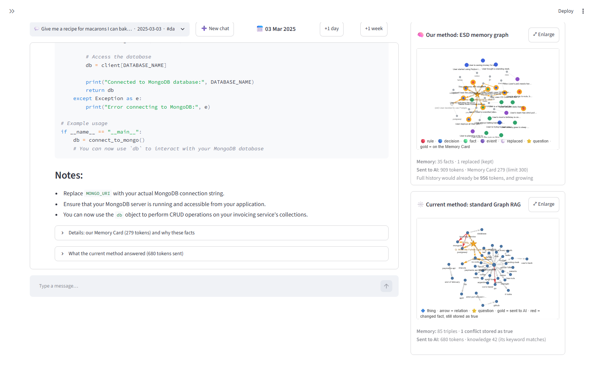

# ESD Memory: demo version

A working demo of **Episodic Schema Distillation (ESD)**: long-term chat memory stored as a dated knowledge graph that changes facts without deleting them, finds hidden links, and fits into a fixed-size Memory Card. It runs on the OpenAI API, so no GPU is needed.

- The plain-English plan is in [plan.md](plan.md).
- The build checklist and its status are in [tasks.md](tasks.md).



The demo screen puts **our memory graph** next to the **standard Graph RAG graph** that today's systems build from the same messages:

| Left 70% | Right 30% |
|---|---|
| Chat with the assistant. You can open multiple chats, move the date forward, and compare the two methods' answers under each reply | **Top:** our graph (ESD). **Bottom:** the current method (standard Graph RAG). Each panel has an **⤢ Enlarge** button. |

## Results

Final run: 30 Sep 2026, `gpt-4o-mini`, temperature 0. 14 tests × 5 assistants, each marked pass/fail by an examiner AI. The full table, the per-test grid and every answer are in [results/summary.md](results/summary.md) and on the app's **Results** page ([screenshot](docs/results_page.png)).

| Assistant | Rules respected | Development tests (8) | Held-out tests (6) | Avg tokens sent per question |
|---|---|---|---|---|
| **ESD-Lite (ours)** | **14/14** | 8/8 | 6/6 | 488 |
| Full history | 14/14 | 8/8 | 6/6 | 1,261 |
| Vector RAG | 13/14 | 7/8 | 6/6 | 329 |
| Standard Graph RAG | 7/14 | 2/8 | 5/6 | 271 |
| No memory | 2/14 | 0/8 | 2/6 | 229 |

**What this shows:**
- **Hidden links:** on the nut allergy → macarons test, only ours and full history passed. Vector RAG and standard Graph RAG both gave a classic almond-flour recipe.
- **Changed facts and dates:** standard Graph RAG kept both databases (it wrote PostgreSQL code) and couldn't say which city or car was the right one for February. Ours marks old facts as replaced and keeps their dates.
- **Cost:** full history was just as accurate here, but it sent 2.6× more tokens, and that grows with every message. Our Memory Card is capped at 300 tokens. See the growth chart on the Results page.

**Limits (read before quoting these numbers):**
- **Small sample.** 14 tests is small, and our lead over vector RAG is a single test.
- **Development tests guided the build.** A failure in run 1 (ours 7/8, see [results/run1_before_fix](results/run1_before_fix)) led to one retriever fix: replaced facts can now answer questions about the past. The 6 held-out tests were written after all fixes and were not used for tuning. They turned out easier than hoped (vector RAG 6/6).
- **The examiner is also `gpt-4o-mini`.** A hand check of answers found two lenient marks, both for "No memory":
  - On the cake test it passed by suggesting nothing. The criterion was tightened and the answers re-marked.
  - On the gluten test it passed while suggesting granola, which is usually not gluten-free. This one is left as marked.

## Setup (Windows, PowerShell)

```powershell
python -m venv .venv
.venv\Scripts\activate
pip install -r requirements.txt
copy .env.example .env      # then open .env and paste your OpenAI key
python scripts/check_api.py # should print a reply and "length 1536"
```

## Run

| What | Command |
|---|---|
| Demo screen | `streamlit run app.py` |
| Our memory in the terminal (quick check) | `python scripts/demo_cli.py` |
| Save both graphs as HTML (`data/preview_*.html`) | `python scripts/preview_graphs.py` |
| Check the "replaced-by" judgement on known cases | `python scripts/check_revision.py` |
| Full comparison, 14 tests × 5 assistants (results appear on the app's **Results** page) | `python eval/run_eval.py` |
| Quick comparison run | `python eval/run_eval.py --only esd,graph_rag --limit 2` |
| Re-mark saved answers after changing a pass criterion | `python eval/run_eval.py --rejudge` |
| Offline tests (no key needed) | `python -m pytest` |

Before presenting, open the sidebar (the `>` at the top left) and click **Load demo history** once. It reads a ~40-message "background life" into both memories. After that it is saved and loads instantly. The talk track, with what a rehearsal actually showed, is in [docs/demo_script.md](docs/demo_script.md).

## How it maps to the research spec

| Spec | Here | File |
|---|---|---|
| 4.1 Schema extraction | An OpenAI model extracts typed facts (constraint / decision / event / fact), each with a topic slot and "trigger" situations | `esd/extractor.py` |
| 4.2 Bi-temporal graph | Each fact has valid time (true from/to) and transaction time (learned / stopped believing) | `esd/graph_store.py` |
| 4.2 AGM revision | Contradicted facts are closed and linked with SUPERSEDES. Nothing is deleted. The model writes a short reason before each same / replaces / unrelated label. | `esd/revision.py` |
| 4.3 HT-GNN relational walk | Question expansion, embedding seeds (including replaced facts, for questions about the past), Personalized PageRank, and the spec's decay formula with hand-set rates | `esd/retriever.py` |
| 4.4 / 4.5 Perceiver + K=64 soft prefix | A **fixed text Memory Card, at most 300 tokens**. OpenAI models only accept text, so vectors can't be injected. | `esd/memory_card.py` |
| Baselines | No memory, full history, vector RAG, standard Graph RAG (LightRAG / GraphRAG-style local search) | `baselines/` |
| 6.3 metrics | CCS (examiner AI pass rate), tokens sent, latency, CCR compression | `eval/run_eval.py` |

## Fair comparison

Every assistant is set up the same way:
- the same OpenAI model and the same answer prompt (`esd/prompts.py`)
- the same messages, background life and examiner
- only the memory differs

The standard Graph RAG baseline is built the way those systems work. It is not weakened to make ESD look better. The example sentences inside the prompts are deliberately *not* the test cases.

## Settings

The model names, card size and fading speeds are in `esd/config.py`. You can override them in `.env` (see `.env.example`). App data (chats, memories, embedding cache) lives in `data/`, which is never committed.
